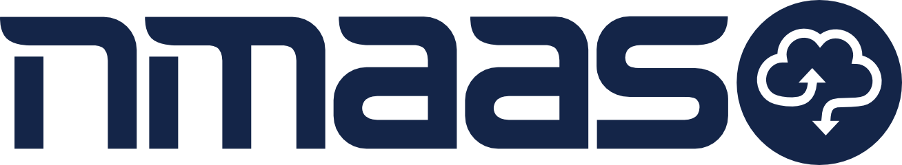

  

  <h3 align="center">nmaas Platform (Front-end)</h3>

  <h4 align="center">Open-source multi-tenant platform for effortless, orchestrated deployment of software tools and applications on top of Kubernetes</h4>

  

     
    <a href="https://docs.nmaas.eu/">Explore documentation</a>
    ·
    <a href="https://gitlab.software.geant.org/nmaas/nmaas-portal/-/issues">Report Bug</a>
    ·
    <a href="https://gitlab.software.geant.org/nmaas/nmaas-portal/-/issues">Request Feature</a>
  

## nmaas Portal Component

[nmaas Portal](https://github.com/nmaas-platform/nmaas-portal) represents the front-end application of nmaas that consumes the REST API offered by nmaas Platform. nmaas Portal is an Angular-based application run in user's browser.

### nmaas Portal Development

Explore the nmaas Portal [development and deployment](docs/DEVELOPMENT.md) documentation.

## Get in Touch

Interested users can use the following mailing lists to subscribe to news about nmaas, get in touch with the nmaas development team, or other nmaas users:

- [nmaas-announce@lists.geant.org](mailto:nmaas-announce@lists.geant.org) - public mailing list for announcements shared by the nmaas team with the community ([subscribe here](https://lists.geant.org/sympa/info/nmaas-announce))
- [nmaas@lists.geant.org](mailto:nmaas@lists.geant.org) - private mailing list for contacting the nmaas core team members
- [nmaas-users@lists.geant.org](mailto:nmaas-users@lists.geant.org) - public mailing lists for discussions related to the nmaas usage and development ([subscribe here](https://lists.geant.org/sympa/info/nmaas-users))
